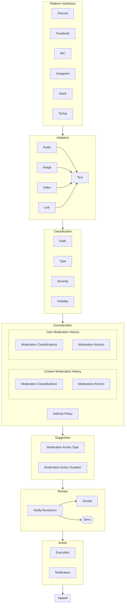

# Aidos, Αἰδώς - Goddess of respect, modesty, and shame. [wiki](https://en.wikipedia.org/wiki/Aidos)

# About

This is a moderation toolsetThis is a project of moderation tools to aid in the administration of communities.

# Features

Moderation

- [] Text
  - [] Emojis
- [] Audio
  - [] Quality - Quality of user audio.
    - [] Volume
    - [] Clarity
    - [] Distortion
  - [] Interuption - Users interupting others.
  - [] Disruption
- [] Image

# Conceptual Design

